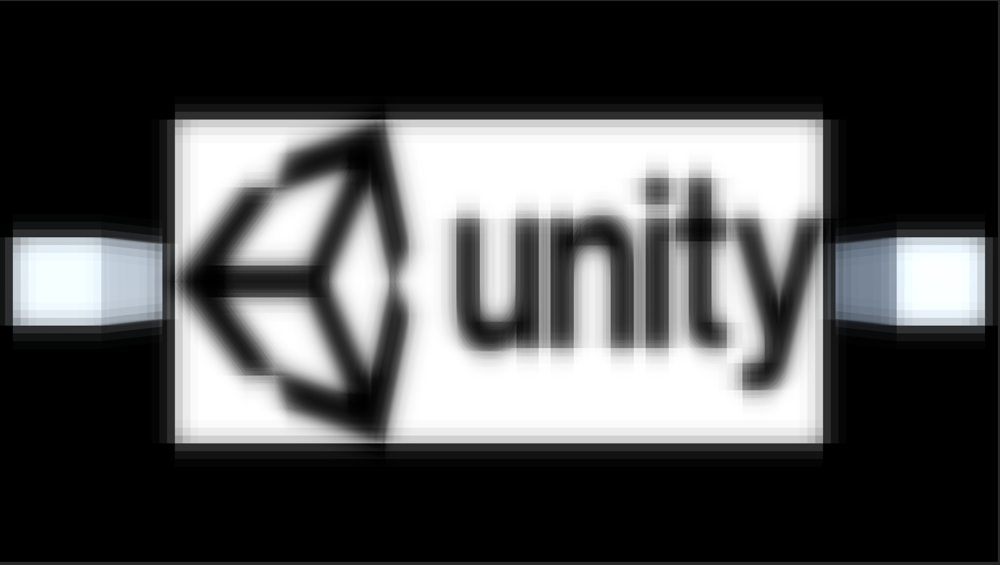

GaussianBlur
===

ガウス関数が釣鐘型の均一変化していく関数なのでXとY軸を切り離して計算を行い、合成しても結果としては同じ物が得られる。  
そこで、ブラー計算時の距離係数をガウス関数の計算結果を使い、ブラーをかける画像のUVを別々に計算することによって計算量が削減でき、高速に計算が可能となる。  

Fragment Shaderで計算するのはガウス関数から算出したWeightを縦(N)と横(M)についてそれぞれ、for文で距離に応じたWeightを周辺ピクセルの色に乗算し、加算していく。  
for文が入れ子になってないので、N * MではなくN + Mのループ数になっている。  

 

